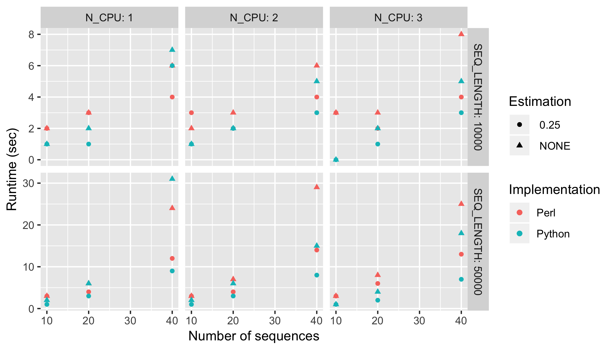

## Hamming distance

This project re-implements hamming distance calculation betweeen pairs of sequences in an alignment.

The original implementation is the Perl script [pairwiseDistances.pl](perl_implementation/pairwiseDistances.pl) and the new implementation is the Python script [calc_hamming_dist.py](python_implementation/calc_hamming_dist.py).

### Requirements
The Python version requires Biopython (see [requirements.txt](python_implementation/requirements.txt)), and Biopython requires Python 3.6 or later.

### Inputs
Both scripts take the same inputs, except that the Python version cannot read from stdin.

### Outputs
Both scripts produce the same output, by default to stdout. Log messages are identical except for frequency of queue logging.

### Containerization
The directories for each script contain a Dockerfile that will create a container with the scripts and their requirements:
* [Perl implementation Dockerfile](perl_implementation/Dockerfile)
* [Python implementation Dockerfile](python_implementation/Dockerfile)

### Speed
A preliminary speedcheck shows the Python implementation is faster, at least for very small simulated genomes:
